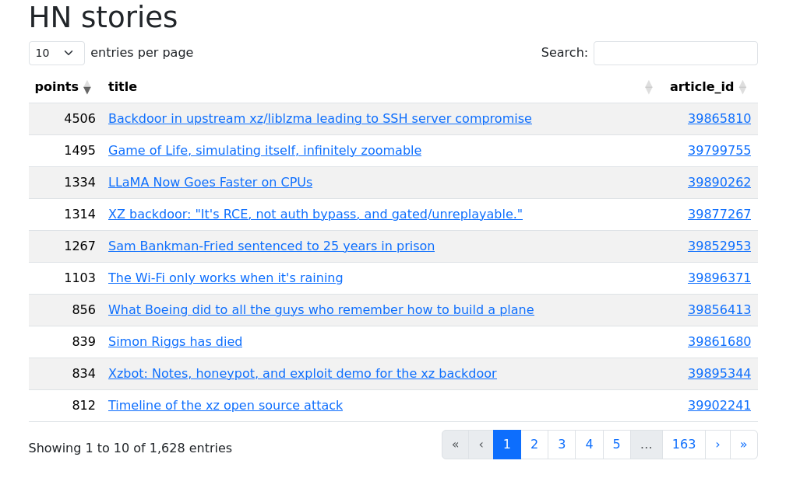

# HN-Scraper (or rather from the [official api](https://github.com/HackerNews/API))

[Test instance](https://hn.mikusr.info)

Application for getting stories from HN and displaying them in a [datatable](https://datatables.net/) as a Vue 3
component.



## Requirements

- PHP 7.4
- MySQL (tested on 8.0.35) or SQLite
- Node.js 20

## Install

clone repository

```bash
$ git clone https://github.com/MikusR/hn-scraper.git
```

use Composer to get dependencies

```bash
$ composer install
```

generate Laravel app key

```bash
php artisan key:generate
```

use npm to get dependencies for Vue

```bash
$ npm install
```

build assets

```bash
$ npm run production
```

copy .env.example to .env
and configure access to database
for example:

```ini
DB_CONNECTION = sqlite
DB_HOST = 127.0.0.1
DB_PORT = 3306
```

If using sqlite

```bash
touch database/database.sqlite
```

Run artisan migrate to create database tables

```bash
php artisan migrate
```

run

```bash
php artisan serve
```

add cron job to run schedule

```bash
crontab -e
```

```cronexp
* * * * * cd /{your path} && php artisan schedule:run >> /dev/null 2>&1
```

## Commands

App comes with different ways to get data

for example

```bash
php artisan scrape:fromapi
```

uses official HN api to get links

command by default fetches `best` stories. There are also `new` and `top` to be used like this

```bash
php artisan scrape:fromapi new
```

Default schedule gets `new` stories every hour and `best` and `top` every couple hours
